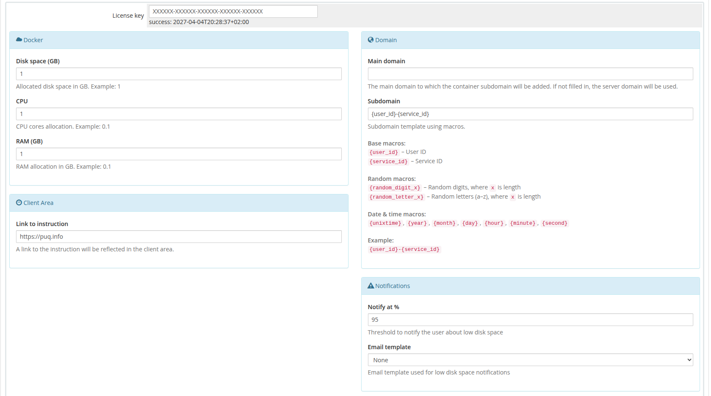

# Product Configuration

### Docker n8n module **[WHMCS](https://puqcloud.com/link.php?id=77)**
#####  [Order now](https://puqcloud.com/whmcs-module-docker-n8n.php) | [Download](https://download.puqcloud.com/WHMCS/servers/PUQ_WHMCS-Docker-n8n/) | [FAQ](https://faq.puqcloud.com/) | [n8n](https://puqcloud.com/link.php?id=117)

## Add new product to WHMCS

Navigate to: **System Settings → Products/Services → Create a New Product**

In the **Module Settings** section, select the **"PUQ Docker n8n"** module.

---

## Configuration parameters

| Parameter | Description |
|-----------|-------------|
| **License key** | A pre-purchased license key for the PUQ Docker n8n module. For the module to work correctly, the key must be active |
| **Disk space (GB)** | Allocated disk space for the Docker container in GB |
| **CPU** | CPU cores allocated for the Docker container (e.g., 0.1, 1, 2) |
| **RAM (GB)** | RAM allocated to the Docker container in GB (e.g., 0.1, 1, 2) |
| **Main domain** | The primary domain for the web interface of the application. If not set, the main domain will be taken from the **hostname** parameter in the server settings |
| **Subdomain** | A personal subdomain assigned to each service. If left empty or if the subdomain is already taken, it will be automatically generated |
| **Link to instruction** | URL to a guide that will be displayed in the client panel if provided |
| **Notification at %** | The percentage threshold for disk space usage that triggers a notification to the client. Set 0 to disable |
| **Notification email template** | The email template for the notification that will be sent when the threshold is reached |

---

## Supported Macros for Subdomain

| Macro | Description |
|-------|-------------|
| `{user_id}` | Client ID |
| `{service_id}` | Service ID |
| `{random_digit_x}` | Random number (x defines the length) |
| `{random_letter_x}` | Random letter (x defines the length) |
| `{unixtime}` | Unix timestamp |
| `{year}` | Year |
| `{month}` | Month |
| `{day}` | Day |
| `{hour}` | Hour |
| `{minute}` | Minute |
| `{second}` | Second |

Default subdomain template: `{user_id}-{service_id}-{second}`

---

