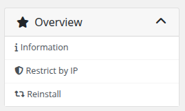

# Home Screen

### Docker n8n module **[WHMCS](https://puqcloud.com/link.php?id=77)**
#####  [Order now](https://puqcloud.com/whmcs-module-docker-n8n.php) | [Download](https://download.puqcloud.com/WHMCS/servers/PUQ_WHMCS-Docker-n8n/) | [FAQ](https://faq.puqcloud.com/) | [n8n](https://puqcloud.com/link.php?id=117)

## Overview

The client area home screen provides quick access to the n8n instance, real-time monitoring of resource usage, and essential management functions in one place.

---

## Main Sections

### Navigation Block

- **User Manual** — Link to the documentation (if configured in product settings)

### Connection Details

- **n8n Web Interface** — Direct link to the n8n instance with a copy button
- **Change Owner Password** — Button to change the n8n owner password via modal dialog

### Resource Usage (Container Status)

Real-time monitoring of container resources:

- **Status** — Current container state (Running, Stopped, Paused, etc.)
- **CPU Usage** — CPU allocation and current load with progress bar
- **Memory Usage** — RAM consumption with progress bar
- **Disk Usage** — Storage usage with progress bar
- **Refresh** — Button to reload container statistics

### Application Information

- **Version** — Installed n8n version
- **Users** — List of active users in the n8n instance

---

## Sidebar Navigation

- **Information** — Main dashboard (home screen)
- **Restrict by IP** — IP access control configuration
- **Reinstall** — Full service reinstallation

---

