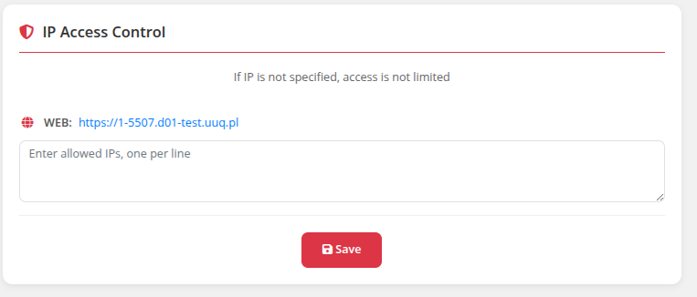

# IP Access Control

### Docker n8n module **[WHMCS](https://puqcloud.com/link.php?id=77)**
#####  [Order now](https://puqcloud.com/whmcs-module-docker-n8n.php) | [Download](https://download.puqcloud.com/WHMCS/servers/PUQ_WHMCS-Docker-n8n/) | [FAQ](https://faq.puqcloud.com/) | [n8n](https://puqcloud.com/link.php?id=117)

## Overview

The IP Access Control page allows clients to restrict access to their n8n instance by specifying allowed IP addresses.

## Configuration

- Navigate to **Restrict by IP** in the sidebar
- Enter approved IP addresses in the text area (one IP per line)
- Supports both IPv4 and IPv6 addresses
- Click **Save** to apply changes

## Important

- If no IP addresses are configured, access is open to all IP addresses
- Invalid IP addresses are automatically filtered out
- Duplicate entries are removed

