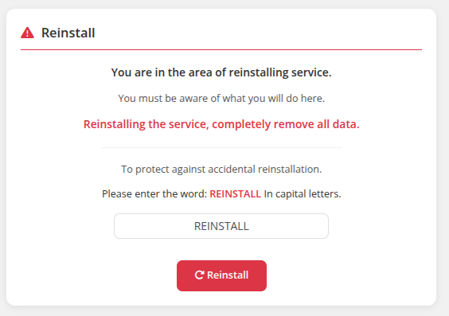

# Reinstall

### Docker n8n module **[WHMCS](https://puqcloud.com/link.php?id=77)**
#####  [Order now](https://puqcloud.com/whmcs-module-docker-n8n.php) | [Download](https://download.puqcloud.com/WHMCS/servers/PUQ_WHMCS-Docker-n8n/) | [FAQ](https://faq.puqcloud.com/) | [n8n](https://puqcloud.com/link.php?id=117)

## Overview

The reinstall feature allows clients to fully reinstall their n8n application. This operation causes **complete data loss**.

## Protection Against Accidental Reinstallation

To prevent accidental reinstallation, the client must:

1. Navigate to **Reinstall** in the sidebar
2. Type the word **REINSTALL** (in capital letters) in the verification field
3. Click the **Reinstall** button
4. Confirm the action in the dialog prompt

> **Warning:** Reinstalling the service will completely remove all data. This action cannot be undone.

