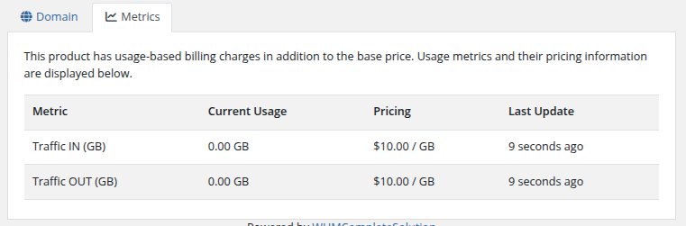

# Metrics

### Docker n8n module **[WHMCS](https://puqcloud.com/link.php?id=77)**
#####  [Order now](https://puqcloud.com/whmcs-module-docker-n8n.php) | [Download](https://download.puqcloud.com/WHMCS/servers/PUQ_WHMCS-Docker-n8n/) | [FAQ](https://faq.puqcloud.com/) | [n8n](https://puqcloud.com/link.php?id=117)

## Overview

If you use metrics for application traffic billing, the **Metrics** tab will display the usage statistics for the metrics.

## Available Metrics

| Metric | Description |
|--------|-------------|
| **Traffic IN (GB)** | Incoming network traffic in gigabytes |
| **Traffic OUT (GB)** | Outgoing network traffic in gigabytes |

