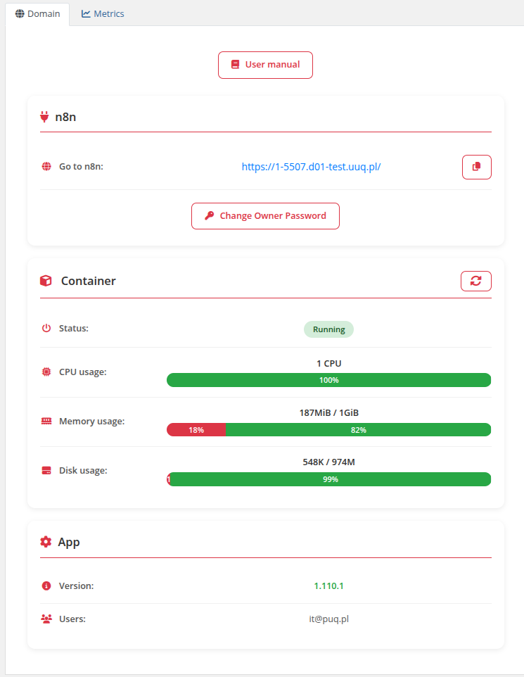
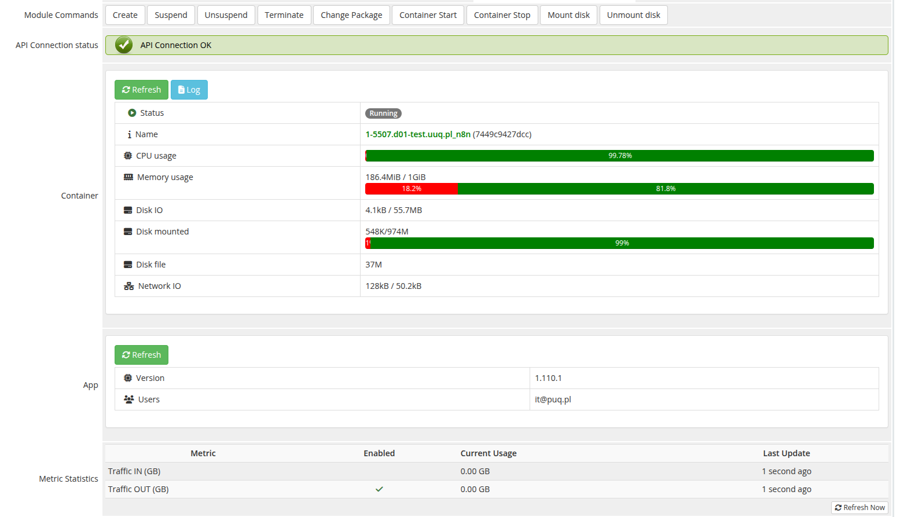

# Description

### Docker n8n module **[WHMCS](https://puqcloud.com/link.php?id=77)**
#####  [Order now](https://puqcloud.com/whmcs-module-docker-n8n.php) | [Download](https://download.puqcloud.com/WHMCS/servers/PUQ_WHMCS-Docker-n8n/) | [FAQ](https://faq.puqcloud.com/) | [n8n](https://puqcloud.com/link.php?id=117)

## Docker n8n WHMCS module

The **WHMCS Docker n8n module** is designed for automated provisioning and management of n8n workflow automation instances on a Docker server. It seamlessly integrates with WHMCS, allowing businesses to sell and manage n8n services efficiently.

>Before you start, it is important to read and familiarize yourself with the following articles at this link:
[https://doc.puq.info/books/docker-modules](https://doc.puq.info/books/docker-modules)

---

## Key Features

### Automated Container Management

- Automatic creation of an n8n container upon service order
- Automated package upgrades

### Service Control & Security

- Service creation
- Service suspension and reactivation
- Service termination
- Full reinstallation
- IP access control

### Advanced Diagnostic Tools

- Built-in tools for diagnosing and managing containers
- Container logs viewer
- Real-time resource monitoring (CPU, Memory, Disk)

### Multilingual Support

- Supports multiple languages, including **Arabic, Azerbaijani, Catalan, Chinese, Croatian, Czech, Danish, Dutch, English, Estonian, Farsi, French, German, Hebrew, Hungarian, Italian, Macedonian, Norwegian, Polish, Romanian, Russian, Spanish, Swedish, Turkish, and Ukrainian**

### Fully Customizable Workflows

- Uses **n8n workflows** to automate processes, allowing full customization for business-specific needs

---

## Admin Panel Options

- Create, Suspend, Unsuspend, Terminate, Change Package
- Container Start / Container Stop
- Mount Disk / Unmount Disk
- API connection status
- Container status and resource monitoring
- Container logs
- Application information

## Client Panel Options

- n8n web interface access link
- Container status with CPU, Memory, Disk usage
- Application version and user information
- Change owner password
- IP Access Control (Restrict by IP)
- Reinstall service
- Metric statistics (Traffic IN/OUT)

---

## System requirements

| Requirement | Minimum                    |
|-------------|----------------------------|
| WHMCS | 9+                     |
| PHP | 8.1, or 8.2                |
| ionCube Loader | v13 or newer (v14, v15)    |
| Docker server | Debian 12 with Docker installed |
| n8n server | For workflow automation    |

---

## Links

- **Product page:** [https://puqcloud.com/whmcs-module-docker-n8n.php](https://puqcloud.com/whmcs-module-docker-n8n.php)
- **Documentation:** [https://doc.puq.info/books/docker-n8n-whmcs-module](https://doc.puq.info/books/docker-n8n-whmcs-module)
- **Support:** [https://puqcloud.com/submitticket.php](https://puqcloud.com/submitticket.php?step=2&deptid=1)
- **Community:** [https://community.puqcloud.com/](https://community.puqcloud.com/)

---

## Screenshots

### Client area — Home screen

### Admin area — Product information

